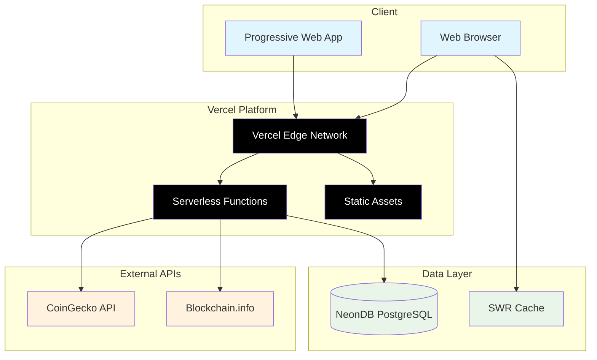

# MVP System Architecture Document

## Bitcoin Mining Economics Web Application

**Version:** MVP 1.0  
**Date:** December 2024  
**Deployment:** Vercel + NeonDB Stack  
**Focus:** Rapid Development & Deployment

---

## Architecture Philosophy

### MVP Principles

1. **Simplicity First**: Minimize complexity to maximize development speed
2. **Serverless Architecture**: Leverage managed services to reduce operational overhead
3. **Rapid Iteration**: Architecture supports fast feedback cycles and deployment
4. **Cost Efficiency**: Use free/low-cost services during validation phase
5. **Future-Proof Foundation**: Simple architecture that can scale when needed

### Technology Selection Rationale

- **Vercel**: Best-in-class developer experience with automatic deployments
- **NeonDB**: Serverless PostgreSQL with generous free tier and instant scaling
- **Next.js**: Full-stack React framework with excellent Vercel integration
- **TypeScript**: Type safety for financial calculations without complexity overhead

---

## High-Level MVP Architecture



---

## Technology Stack Details

### Frontend Architecture

#### Core Technologies

```typescript
interface MVPFrontendStack {
  framework: {
    name: "Next.js 14";
    features: ["App Router", "Server Components", "API Routes"];
    benefits: ["Built-in optimization", "Vercel integration", "SEO-friendly"];
  };

  language: {
    name: "TypeScript 5+";
    config: "Strict mode for financial calculations";
    benefits: ["Type safety", "Better IDE support", "Runtime error prevention"];
  };

  styling: {
    name: "Tailwind CSS 3+";
    approach: "Utility-first with component classes";
    benefits: ["Rapid development", "Consistent design", "Small bundle size"];
  };

  stateManagement: {
    name: "React State + SWR";
    scope: "Local state + server state caching";
    benefits: [
      "Simple mental model",
      "Automatic revalidation",
      "Offline support"
    ];
  };

  dataFetching: {
    name: "SWR (stale-while-revalidate)";
    strategy: "Cache-first with background updates";
    benefits: ["Automatic caching", "Request deduplication", "Error recovery"];
  };

  charts: {
    primary: "Recharts";
    fallback: "Chart.js via react-chartjs-2";
    benefits: ["React-native", "TypeScript support", "Responsive design"];
  };
}
```

#### Project Structure

```
src/
├── app/                          # Next.js App Router
│   ├── api/                     # API Routes
│   │   ├── market-data/         # Market data endpoints
│   │   ├── calculations/        # Mining calculations
│   │   └── operations/          # Saved operations
│   ├── calculator/              # Main calculator page
│   ├── dashboard/               # Dashboard view
│   ├── globals.css              # Global styles
│   ├── layout.tsx               # Root layout
│   └── page.tsx                 # Homepage
├── components/                   # Reusable UI components
│   ├── ui/                      # Base UI components
│   │   ├── Button.tsx
│   │   ├── Input.tsx
│   │   ├── Card.tsx
│   │   └── index.ts
│   ├── calculator/              # Calculator-specific components
│   │   ├── ParameterForm.tsx
│   │   ├── ResultsDisplay.tsx
│   │   └── ScenarioComparison.tsx
│   ├── charts/                  # Chart components
│   │   ├── ProfitabilityChart.tsx
│   │   ├── BreakEvenChart.tsx
│   │   └── CostBreakdownChart.tsx
│   └── layout/                  # Layout components
│       ├── Header.tsx
│       ├── Footer.tsx
│       └── Navigation.tsx
├── lib/                         # Utility libraries
│   ├── calculations.ts          # Core calculation logic
│   ├── api-client.ts           # API client utilities
│   ├── validations.ts          # Zod schemas
│   └── utils.ts                # Helper functions
├── hooks/                       # Custom React hooks
│   ├── useMarketData.ts
│   ├── useCalculations.ts
│   └── useLocalStorage.ts
├── types/                       # TypeScript definitions
│   ├── mining.ts
│   ├── market.ts
│   └── api.ts
└── constants/                   # App constants
    ├── hardware-presets.ts
    └── mining-pools.ts
```

### Backend Architecture (Serverless)

#### API Routes Structure

```typescript
// Next.js API Routes in app/api/
interface APIStructure {
  "/api/market-data": {
    GET: "Current Bitcoin price, hash rate, difficulty";
    cache: "SWR + Vercel Edge Cache (1 hour)";
  };

  "/api/calculations": {
    POST: "Calculate mining profitability";
    input: "Mining parameters + market conditions";
    output: "Financial results + projections";
  };

  "/api/operations": {
    GET: "List saved operations";
    POST: "Save new operation";
    PUT: "Update operation";
    DELETE: "Delete operation";
  };

  "/api/scenarios": {
    POST: "Compare multiple scenarios";
    input: "Base parameters + scenario variations";
    output: "Comparative analysis results";
  };
}

// Example API route implementation
// app/api/market-data/route.ts
export async function GET() {
  try {
    // Check cache first
    const cached = await getCachedMarketData();
    if (cached && !isStale(cached, 3600)) {
      // 1 hour cache
      return NextResponse.json(cached);
    }

    // Fetch fresh data
    const marketData = await fetchMarketDataFromAPIs();

    // Cache the result
    await cacheMarketData(marketData);

    return NextResponse.json(marketData, {
      headers: {
        "Cache-Control": "public, s-maxage=3600, stale-while-revalidate=86400",
      },
    });
  } catch (error) {
    return NextResponse.json(
      { error: "Failed to fetch market data" },
      { status: 500 }
    );
  }
}
```

### Database Architecture (NeonDB)

#### Simplified Schema

```sql
-- MVP database schema optimized for NeonDB serverless
CREATE EXTENSION IF NOT EXISTS "uuid-ossp";

-- Mining operations table
CREATE TABLE operations (
  id UUID PRIMARY KEY DEFAULT uuid_generate_v4(),
  name VARCHAR(255) NOT NULL,

  -- Mining parameters
  hash_rate DECIMAL(12,6) NOT NULL,           -- EH/s
  power_consumption DECIMAL(10,3) NOT NULL,   -- MW
  electricity_rate DECIMAL(8,6) NOT NULL,     -- USD/kWh
  hardware_cost DECIMAL(15,2) NOT NULL,       -- USD
  setup_cost DECIMAL(12,2) DEFAULT 0,         -- USD
  maintenance_cost DECIMAL(10,2) DEFAULT 0,   -- USD/month

  -- Metadata
  hardware_type VARCHAR(100),                 -- e.g., 'Antminer S19 Pro'
  location VARCHAR(100),                      -- e.g., 'Texas, USA'
  notes TEXT,

  -- Timestamps
  created_at TIMESTAMPTZ DEFAULT NOW(),
  updated_at TIMESTAMPTZ DEFAULT NOW(),

  -- Indexes for common queries
  INDEX idx_operations_created_at (created_at DESC),
  INDEX idx_operations_hardware_type (hardware_type)
);

-- Market data cache table
CREATE TABLE market_data_cache (
  id UUID PRIMARY KEY DEFAULT uuid_generate_v4(),

  -- Market metrics
  btc_price_usd DECIMAL(12,2) NOT NULL,
  network_hash_rate_ehs DECIMAL(15,6) NOT NULL,
  difficulty BIGINT NOT NULL,
  block_reward DECIMAL(10,8) DEFAULT 3.125,

  -- Data source tracking
  price_source VARCHAR(50) NOT NULL,          -- 'coingecko', 'binance'
  hash_rate_source VARCHAR(50) NOT NULL,      -- 'blockchain.info'

  -- Timing
  fetched_at TIMESTAMPTZ DEFAULT NOW(),

  -- Keep only recent data (auto-cleanup)
  INDEX idx_market_data_fetched_at (fetched_at DESC)
);

-- Calculation results cache (optional for performance)
CREATE TABLE calculation_cache (
  id UUID PRIMARY KEY DEFAULT uuid_generate_v4(),

  -- Input hash for cache key
  parameters_hash VARCHAR(64) NOT NULL UNIQUE,

  -- Calculation results (stored as JSONB)
  results JSONB NOT NULL,

  -- Cache metadata
  calculated_at TIMESTAMPTZ DEFAULT NOW(),
  expires_at TIMESTAMPTZ NOT NULL,

  INDEX idx_calculation_cache_hash (parameters_hash),
  INDEX idx_calculation_cache_expires (expires_at)
);

-- Auto-cleanup old data (NeonDB supports this)
CREATE OR REPLACE FUNCTION cleanup_old_data()
RETURNS void AS $$
BEGIN
  -- Keep only last 7 days of market data
  DELETE FROM market_data_cache
  WHERE fetched_at < NOW() - INTERVAL '7 days';

  -- Clean expired calculation cache
  DELETE FROM calculation_cache
  WHERE expires_at < NOW();
END;
$$ LANGUAGE plpgsql;

-- Schedule cleanup (can be triggered by cron job or API call)
```

#### Database Connection (Serverless)

```typescript
// lib/db.ts - NeonDB connection for serverless functions
import { Pool, neonConfig } from "@neondatabase/serverless";

// Configure for serverless environment
neonConfig.fetchConnectionCache = true;

class Database {
  private static instance: Database;
  private pool: Pool;

  private constructor() {
    this.pool = new Pool({
      connectionString: process.env.DATABASE_URL,
      ssl: true,
      max: 1, // Limit connections for serverless
    });
  }

  static getInstance(): Database {
    if (!Database.instance) {
      Database.instance = new Database();
    }
    return Database.instance;
  }

  async query(text: string, params?: any[]) {
    const start = Date.now();
    try {
      const result = await this.pool.query(text, params);
      console.log(`Query executed in ${Date.now() - start}ms`);
      return result;
    } catch (error) {
      console.error("Database query error:", error);
      throw error;
    }
  }

  async transaction<T>(callback: (client: any) => Promise<T>): Promise<T> {
    const client = await this.pool.connect();
    try {
      await client.query("BEGIN");
      const result = await callback(client);
      await client.query("COMMIT");
      return result;
    } catch (error) {
      await client.query("ROLLBACK");
      throw error;
    } finally {
      client.release();
    }
  }
}

export const db = Database.getInstance();
```

---

## Core Calculation Engine

### Financial Calculations (TypeScript)

```typescript
// lib/calculations.ts - Core mining economics calculations
export interface MiningParameters {
  hashRate: number; // EH/s
  powerConsumption: number; // MW
  electricityRate: number; // USD/kWh
  hardwareCost: number; // USD
  setupCost: number; // USD
  maintenanceCost: number; // USD/month
}

export interface MarketConditions {
  btcPriceUSD: number;
  networkHashRateEHS: number;
  difficulty: number;
  blockReward: number; // BTC per block
}

export interface CalculationResults {
  revenue: {
    btcPerDay: number;
    usdPerDay: number;
    usdPerMonth: number;
    usdPerYear: number;
    projectedMonthly: number[]; // 12-month projection
  };
  costs: {
    electricityPerDay: number;
    electricityPerMonth: number;
    maintenancePerMonth: number;
    totalOperatingPerMonth: number;
  };
  profitability: {
    grossProfitPerDay: number;
    grossProfitPerMonth: number;
    netProfitPerMonth: number; // After all costs
    profitMarginPercent: number;
    breakEvenBtcPrice: number;
  };
  investment: {
    totalInitialInvestment: number;
    monthlyROI: number; // %
    annualROI: number; // %
    paybackPeriodMonths: number;
    npv12Months: number; // Assuming 10% discount rate
  };
}

export class MiningCalculator {
  private readonly BLOCKS_PER_DAY = 144;
  private readonly HOURS_PER_DAY = 24;
  private readonly DAYS_PER_MONTH = 30.44;
  private readonly DISCOUNT_RATE = 0.1; // 10% annual for NPV

  calculate(
    params: MiningParameters,
    market: MarketConditions
  ): CalculationResults {
    // Revenue calculations
    const hashSharePercent = params.hashRate / market.networkHashRateEHS;
    const btcPerDay =
      this.BLOCKS_PER_DAY * market.blockReward * hashSharePercent;
    const usdPerDay = btcPerDay * market.btcPriceUSD;
    const usdPerMonth = usdPerDay * this.DAYS_PER_MONTH;
    const usdPerYear = usdPerDay * 365.25;

    // Generate 12-month projection (assuming 5% monthly network growth)
    const projectedMonthly = this.generateProjection(usdPerMonth, 12, 0.05);

    // Cost calculations
    const electricityPerDay =
      params.powerConsumption * this.HOURS_PER_DAY * params.electricityRate;
    const electricityPerMonth = electricityPerDay * this.DAYS_PER_MONTH;
    const totalOperatingPerMonth = electricityPerMonth + params.maintenanceCost;

    // Profitability calculations
    const grossProfitPerDay = usdPerDay - electricityPerDay;
    const grossProfitPerMonth = usdPerMonth - electricityPerMonth;
    const netProfitPerMonth = grossProfitPerMonth - params.maintenanceCost;
    const profitMarginPercent = (netProfitPerMonth / usdPerMonth) * 100;

    // Break-even BTC price (where profit = 0)
    const breakEvenBtcPrice =
      (electricityPerDay + params.maintenanceCost / this.DAYS_PER_MONTH) /
      btcPerDay;

    // Investment calculations
    const totalInitialInvestment = params.hardwareCost + params.setupCost;
    const monthlyROI = (netProfitPerMonth / totalInitialInvestment) * 100;
    const annualROI = monthlyROI * 12;
    const paybackPeriodMonths =
      totalInitialInvestment / Math.max(netProfitPerMonth, 1);

    // NPV calculation (12 months)
    const npv12Months = this.calculateNPV(
      projectedMonthly.map((revenue) => revenue - totalOperatingPerMonth),
      totalInitialInvestment,
      this.DISCOUNT_RATE / 12 // Monthly discount rate
    );

    return {
      revenue: {
        btcPerDay,
        usdPerDay,
        usdPerMonth,
        usdPerYear,
        projectedMonthly,
      },
      costs: {
        electricityPerDay,
        electricityPerMonth,
        maintenancePerMonth: params.maintenanceCost,
        totalOperatingPerMonth,
      },
      profitability: {
        grossProfitPerDay,
        grossProfitPerMonth,
        netProfitPerMonth,
        profitMarginPercent,
        breakEvenBtcPrice,
      },
      investment: {
        totalInitialInvestment,
        monthlyROI,
        annualROI,
        paybackPeriodMonths,
        npv12Months,
      },
    };
  }

  private generateProjection(
    baseValue: number,
    months: number,
    monthlyGrowthRate: number
  ): number[] {
    const projection = [];
    let currentValue = baseValue;

    for (let i = 0; i < months; i++) {
      projection.push(currentValue);
      // Apply network growth (reduces individual miner's share)
      currentValue = currentValue / (1 + monthlyGrowthRate);
    }

    return projection;
  }

  private calculateNPV(
    cashFlows: number[],
    initialInvestment: number,
    discountRate: number
  ): number {
    let npv = -initialInvestment;

    cashFlows.forEach((cashFlow, index) => {
      npv += cashFlow / Math.pow(1 + discountRate, index + 1);
    });

    return npv;
  }
}
```

---

## Data Flow Architecture

### Client-Side Data Flow

```typescript
// hooks/useMarketData.ts - SWR-based data fetching
import useSWR from "swr";

interface MarketData {
  btcPriceUSD: number;
  networkHashRateEHS: number;
  difficulty: number;
  blockReward: number;
  lastUpdated: string;
}

const fetcher = (url: string) => fetch(url).then((res) => res.json());

export function useMarketData() {
  const { data, error, isLoading, mutate } = useSWR<MarketData>(
    "/api/market-data",
    fetcher,
    {
      refreshInterval: 60000, // Refresh every minute
      revalidateOnFocus: false, // Don't refetch on window focus
      revalidateOnReconnect: true, // Refetch when internet reconnects
      dedupingInterval: 10000, // Dedupe requests within 10 seconds
      errorRetryCount: 3, // Retry failed requests 3 times
      errorRetryInterval: 5000, // Wait 5 seconds between retries
    }
  );

  return {
    marketData: data,
    isLoading,
    error,
    refresh: mutate,
  };
}

// hooks/useCalculations.ts - Mining calculations with caching
import useSWR from "swr";
import { MiningParameters } from "@/types/mining";

interface CalculationParams {
  parameters: MiningParameters;
  marketData?: MarketData;
}

export function useCalculations({ parameters, marketData }: CalculationParams) {
  // Create cache key from parameters
  const cacheKey = marketData ? ["calculations", parameters, marketData] : null;

  const { data, error, isLoading } = useSWR(
    cacheKey,
    async ([_, params, market]) => {
      const response = await fetch("/api/calculations", {
        method: "POST",
        headers: { "Content-Type": "application/json" },
        body: JSON.stringify({ parameters: params, marketData: market }),
      });

      if (!response.ok) throw new Error("Calculation failed");
      return response.json();
    },
    {
      revalidateOnFocus: false,
      dedupingInterval: 30000, // Cache calculations for 30 seconds
    }
  );

  return {
    results: data,
    isLoading,
    error,
  };
}
```

### Server-Side Data Flow

```typescript
// app/api/calculations/route.ts - Calculation API endpoint
import { NextRequest, NextResponse } from "next/server";
import { MiningCalculator } from "@/lib/calculations";
import { z } from "zod";

// Input validation schema
const CalculationRequestSchema = z.object({
  parameters: z.object({
    hashRate: z.number().positive(),
    powerConsumption: z.number().positive(),
    electricityRate: z.number().positive(),
    hardwareCost: z.number().positive(),
    setupCost: z.number().nonnegative().default(0),
    maintenanceCost: z.number().nonnegative().default(0),
  }),
  marketData: z
    .object({
      btcPriceUSD: z.number().positive(),
      networkHashRateEHS: z.number().positive(),
      difficulty: z.number().positive(),
      blockReward: z.number().positive().default(3.125),
    })
    .optional(),
});

export async function POST(request: NextRequest) {
  try {
    const body = await request.json();
    const { parameters, marketData } = CalculationRequestSchema.parse(body);

    // Use provided market data or fetch current data
    let market = marketData;
    if (!market) {
      const marketResponse = await fetch(
        `${process.env.VERCEL_URL}/api/market-data`
      );
      market = await marketResponse.json();
    }

    // Perform calculations
    const calculator = new MiningCalculator();
    const results = calculator.calculate(parameters, market);

    return NextResponse.json({
      success: true,
      data: results,
      metadata: {
        calculatedAt: new Date().toISOString(),
        marketDataAge: market.lastUpdated,
      },
    });
  } catch (error) {
    console.error("Calculation error:", error);

    if (error instanceof z.ZodError) {
      return NextResponse.json(
        { error: "Invalid input parameters", details: error.errors },
        { status: 400 }
      );
    }

    return NextResponse.json(
      { error: "Internal server error" },
      { status: 500 }
    );
  }
}
```

---

## Caching Strategy (Simplified)

### Multi-Layer Caching

```typescript
interface MVPCachingStrategy {
  layers: {
    browser: {
      technology: "SWR + Browser Cache";
      duration: "30 seconds for calculations, 1 minute for market data";
      strategy: "stale-while-revalidate";
    };

    vercel: {
      technology: "Vercel Edge Cache";
      duration: "1 hour for market data, 5 minutes for calculations";
      headers: "Cache-Control with s-maxage";
    };

    application: {
      technology: "NeonDB query results";
      duration: "Automatic via connection pooling";
      strategy: "Database-level caching";
    };
  };
}

// Example: API response with caching headers
export async function GET() {
  const marketData = await fetchMarketData();

  return NextResponse.json(marketData, {
    headers: {
      // Cache at edge for 1 hour, allow stale for 24 hours
      "Cache-Control": "public, s-maxage=3600, stale-while-revalidate=86400",
      // Add ETag for conditional requests
      ETag: `"${generateETag(marketData)}"`,
      // CORS headers for frontend
      "Access-Control-Allow-Origin": "*",
      "Access-Control-Allow-Methods": "GET",
    },
  });
}
```

---

## Security Architecture (MVP)

### Basic Security Measures

```typescript
interface MVPSecurity {
  authentication: "None (local storage only)";

  inputValidation: {
    library: "Zod schemas";
    scope: "All API inputs and form data";
    sanitization: "Built-in Next.js protections";
  };

  apiSecurity: {
    cors: "Configured for specific origins";
    rateLimit: "Vercel built-in protection";
    headers: "Security headers via next.config.js";
  };

  dataProtection: {
    transport: "HTTPS only (Vercel automatic)";
    storage: "No sensitive data stored";
    validation: "Server-side validation for all inputs";
  };
}

// next.config.js - Security headers
const nextConfig = {
  async headers() {
    return [
      {
        source: "/(.*)",
        headers: [
          {
            key: "X-Frame-Options",
            value: "DENY",
          },
          {
            key: "X-Content-Type-Options",
            value: "nosniff",
          },
          {
            key: "Referrer-Policy",
            value: "origin-when-cross-origin",
          },
          {
            key: "Permissions-Policy",
            value: "camera=(), microphone=(), geolocation=()",
          },
        ],
      },
    ];
  },
};
```

### Input Validation & Sanitization

```typescript
// lib/validations.ts - Zod schemas for type-safe validation
import { z } from "zod";

export const MiningParametersSchema = z.object({
  name: z.string().min(1).max(100),
  hashRate: z
    .number()
    .positive("Hash rate must be positive")
    .max(1000, "Hash rate seems unrealistic"),
  powerConsumption: z
    .number()
    .positive("Power consumption must be positive")
    .max(1000, "Power consumption seems unrealistic"),
  electricityRate: z
    .number()
    .positive("Electricity rate must be positive")
    .max(1, "Electricity rate seems unrealistic"),
  hardwareCost: z
    .number()
    .positive("Hardware cost must be positive")
    .max(10000000, "Hardware cost seems unrealistic"),
  setupCost: z.number().nonnegative("Setup cost cannot be negative").default(0),
  maintenanceCost: z
    .number()
    .nonnegative("Maintenance cost cannot be negative")
    .default(0),
});

export const ScenarioSchema = z.object({
  name: z.string().min(1).max(50),
  btcPriceMultiplier: z
    .number()
    .min(0.1, "Price multiplier too low")
    .max(10, "Price multiplier too high"),
  networkGrowthRate: z
    .number()
    .min(-0.5, "Network growth rate too negative")
    .max(1, "Network growth rate too high"),
  electricityRateMultiplier: z
    .number()
    .min(0.1, "Electricity multiplier too low")
    .max(5, "Electricity multiplier too high"),
});

// Sanitization helper
export function sanitizeInput(input: unknown): unknown {
  if (typeof input === "string") {
    return input.trim().slice(0, 1000); // Limit string length
  }
  if (typeof input === "number") {
    return isFinite(input) ? input : 0;
  }
  return input;
}
```

---

## Performance Optimization

### Bundle Optimization

```typescript
// next.config.js - Optimized build configuration
const nextConfig = {
  // Experimental features for better performance
  experimental: {
    optimizeCss: true,
    optimizeServerReact: true,
  },

  // Image optimization
  images: {
    domains: ["images.unsplash.com"], // Add any external image domains
    formats: ["image/webp", "image/avif"],
  },

  // Compression
  compress: true,

  // Bundle analyzer (development only)
  ...(process.env.ANALYZE === "true" && {
    bundleAnalyzer: {
      enabled: true,
    },
  }),

  // PWA configuration for offline support
  ...(process.env.NODE_ENV === "production" && {
    pwa: {
      dest: "public",
      register: true,
      skipWaiting: true,
      runtimeCaching: [
        {
          urlPattern: /^https?.*/,
          handler: "NetworkFirst",
          options: {
            cacheName: "offlineCache",
            expiration: {
              maxEntries: 200,
              maxAgeSeconds: 86400, // 24 hours
            },
          },
        },
      ],
    },
  }),
};
```

### Component Optimization

```typescript
// components/charts/ProfitabilityChart.tsx - Optimized chart component
import { memo, useMemo } from "react";
import {
  LineChart,
  Line,
  XAxis,
  YAxis,
  CartesianGrid,
  Tooltip,
  ResponsiveContainer,
} from "recharts";

interface ProfitabilityChartProps {
  data: number[];
  loading?: boolean;
}

export const ProfitabilityChart = memo(function ProfitabilityChart({
  data,
  loading = false,
}: ProfitabilityChartProps) {
  // Memoize chart data transformation
  const chartData = useMemo(() => {
    return data.map((profit, index) => ({
      month: index + 1,
      profit: Math.round(profit),
      cumulativeProfit: data.slice(0, index + 1).reduce((sum, p) => sum + p, 0),
    }));
  }, [data]);

  if (loading) {
    return (
      <div className="h-64 flex items-center justify-center bg-gray-50 rounded-lg">
        <div className="animate-spin rounded-full h-8 w-8 border-b-2 border-blue-600" />
      </div>
    );
  }

  return (
    <div className="h-64 w-full">
      <ResponsiveContainer width="100%" height="100%">
        <LineChart data={chartData}>
          <CartesianGrid strokeDasharray="3 3" className="opacity-30" />
          <XAxis
            dataKey="month"
            tick={{ fontSize: 12 }}
            tickFormatter={(value) => `M${value}`}
          />
          <YAxis
            tick={{ fontSize: 12 }}
            tickFormatter={(value) => `${(value / 1000).toFixed(0)}k`}
          />
          <Tooltip
            formatter={(value: number, name: string) => [
              `${value.toLocaleString()}`,
              name === "profit" ? "Monthly Profit" : "Cumulative Profit",
            ]}
            labelFormatter={(month) => `Month ${month}`}
          />
          <Line
            type="monotone"
            dataKey="profit"
            stroke="#3B82F6"
            strokeWidth={2}
            dot={false}
            activeDot={{ r: 4 }}
          />
          <Line
            type="monotone"
            dataKey="cumulativeProfit"
            stroke="#10B981"
            strokeWidth={2}
            strokeDasharray="5 5"
            dot={false}
          />
        </LineChart>
      </ResponsiveContainer>
    </div>
  );
});
```

---

## Deployment & Operations

### Vercel Deployment Configuration

```typescript
// vercel.json - Deployment configuration
{
  "framework": "nextjs",
  "buildCommand": "npm run build",
  "devCommand": "npm run dev",
  "installCommand": "npm install",
  "functions": {
    "app/api/**/*.ts": {
      "maxDuration": 10
    }
  },
  "headers": [
    {
      "source": "/api/(.*)",
      "headers": [
        {
          "key": "Cache-Control",
          "value": "public, s-maxage=300, stale-while-revalidate=3600"
        }
      ]
    }
  ],
  "redirects": [
    {
      "source": "/",
      "destination": "/calculator",
      "permanent": false
    }
  ],
  "env": {
    "DATABASE_URL": "@database-url",
    "COINGECKO_API_KEY": "@coingecko-api-key"
  }
}

// Environment variables configuration
interface EnvironmentVariables {
  // Database
  DATABASE_URL: string;          // NeonDB connection string

  // External APIs
  COINGECKO_API_KEY?: string;    // Optional API key for higher rate limits

  // Application
  NEXT_PUBLIC_APP_URL: string;   // For absolute URLs
  NODE_ENV: 'development' | 'production';

  // Analytics (optional)
  VERCEL_ANALYTICS_ID?: string;
}
```

### Database Migrations

```typescript
// scripts/migrate.ts - Simple migration runner for NeonDB
import { db } from "@/lib/db";

const migrations = [
  {
    version: 1,
    name: "initial_schema",
    sql: `
      CREATE EXTENSION IF NOT EXISTS "uuid-ossp";
      
      CREATE TABLE operations (
        id UUID PRIMARY KEY DEFAULT uuid_generate_v4(),
        name VARCHAR(255) NOT NULL,
        hash_rate DECIMAL(12,6) NOT NULL,
        power_consumption DECIMAL(10,3) NOT NULL,
        electricity_rate DECIMAL(8,6) NOT NULL,
        hardware_cost DECIMAL(15,2) NOT NULL,
        setup_cost DECIMAL(12,2) DEFAULT 0,
        maintenance_cost DECIMAL(10,2) DEFAULT 0,
        hardware_type VARCHAR(100),
        location VARCHAR(100),
        notes TEXT,
        created_at TIMESTAMPTZ DEFAULT NOW(),
        updated_at TIMESTAMPTZ DEFAULT NOW()
      );
    `,
  },
  {
    version: 2,
    name: "market_data_cache",
    sql: `
      CREATE TABLE market_data_cache (
        id UUID PRIMARY KEY DEFAULT uuid_generate_v4(),
        btc_price_usd DECIMAL(12,2) NOT NULL,
        network_hash_rate_ehs DECIMAL(15,6) NOT NULL,
        difficulty BIGINT NOT NULL,
        block_reward DECIMAL(10,8) DEFAULT 3.125,
        price_source VARCHAR(50) NOT NULL,
        hash_rate_source VARCHAR(50) NOT NULL,
        fetched_at TIMESTAMPTZ DEFAULT NOW()
      );
      
      CREATE INDEX idx_market_data_fetched_at ON market_data_cache (fetched_at DESC);
    `,
  },
];

export async function runMigrations() {
  for (const migration of migrations) {
    try {
      console.log(`Running migration: ${migration.name}`);
      await db.query(migration.sql);
      console.log(`✅ Migration ${migration.name} completed`);
    } catch (error) {
      console.error(`❌ Migration ${migration.name} failed:`, error);
      throw error;
    }
  }
}

// Run migrations
if (require.main === module) {
  runMigrations()
    .then(() => console.log("All migrations completed"))
    .catch((error) => {
      console.error("Migration failed:", error);
      process.exit(1);
    });
}
```

### Monitoring & Analytics

```typescript
// lib/analytics.ts - Simple analytics for MVP
interface AnalyticsEvent {
  event: string;
  properties?: Record<string, any>;
  timestamp?: Date;
}

class SimpleAnalytics {
  private events: AnalyticsEvent[] = [];

  track(event: string, properties?: Record<string, any>) {
    // Store events in memory for now (could send to external service)
    this.events.push({
      event,
      properties,
      timestamp: new Date(),
    });

    // Log to console in development
    if (process.env.NODE_ENV === "development") {
      console.log("Analytics:", { event, properties });
    }

    // Could send to Vercel Analytics, PostHog, or other service
    if (typeof window !== "undefined") {
      // Client-side tracking
      window.gtag?.("event", event, properties);
    }
  }

  // Track key user actions
  trackCalculation(parameters: any, results: any) {
    this.track("calculation_performed", {
      hash_rate: parameters.hashRate,
      hardware_cost: parameters.hardwareCost,
      monthly_profit: results.profitability.netProfitPerMonth,
      roi: results.investment.annualROI,
    });
  }

  trackOperationSaved() {
    this.track("operation_saved");
  }

  trackScenarioComparison(scenarioCount: number) {
    this.track("scenario_comparison", { scenario_count: scenarioCount });
  }
}

export const analytics = new SimpleAnalytics();
```

---

## Testing Strategy (MVP)

### Testing Approach

```typescript
// Simplified testing strategy for MVP
interface MVPTestingStrategy {
  unit: {
    framework: "Jest + React Testing Library";
    scope: "Calculation engine, utility functions, components";
    coverage: "80%+ for critical calculation logic";
  };

  integration: {
    framework: "Jest + MSW (Mock Service Worker)";
    scope: "API routes, database operations";
    coverage: "All API endpoints";
  };

  e2e: {
    framework: "Playwright (minimal setup)";
    scope: "Critical user flows only";
    coverage: "Calculator workflow, results display";
  };
}

// Example: Calculation engine tests
// __tests__/calculations.test.ts
import { MiningCalculator } from "@/lib/calculations";

describe("MiningCalculator", () => {
  const calculator = new MiningCalculator();

  const mockParams = {
    hashRate: 0.1, // 0.1 EH/s
    powerConsumption: 3.25, // 3.25 MW
    electricityRate: 0.05, // $0.05/kWh
    hardwareCost: 650000, // $650k
    setupCost: 50000, // $50k
    maintenanceCost: 5000, // $5k/month
  };

  const mockMarket = {
    btcPriceUSD: 50000,
    networkHashRateEHS: 350,
    difficulty: 50000000000000,
    blockReward: 3.125,
  };

  test("calculates revenue correctly", () => {
    const results = calculator.calculate(mockParams, mockMarket);

    // Expected: 0.1/350 * 144 * 3.125 * 50000 ≈ $2,571/day
    expect(results.revenue.usdPerDay).toBeCloseTo(2571, 0);
    expect(results.revenue.usdPerMonth).toBeCloseTo(78291, 0);
  });

  test("calculates costs correctly", () => {
    const results = calculator.calculate(mockParams, mockMarket);

    // Expected: 3.25 MW * 24h * $0.05 = $3,900/day
    expect(results.costs.electricityPerDay).toBeCloseTo(3900, 0);
    expect(results.costs.totalOperatingPerMonth).toBeCloseTo(123678, 0);
  });

  test("handles edge cases", () => {
    // Zero hash rate
    const zeroHashResults = calculator.calculate(
      { ...mockParams, hashRate: 0 },
      mockMarket
    );
    expect(zeroHashResults.revenue.usdPerDay).toBe(0);

    // Very high electricity rate (should be unprofitable)
    const highElectricityResults = calculator.calculate(
      { ...mockParams, electricityRate: 1.0 },
      mockMarket
    );
    expect(highElectricityResults.profitability.netProfitPerMonth).toBeLessThan(
      0
    );
  });
});
```

---

## MVP Limitations & Future Considerations

### Current Limitations

1. **No User Authentication**: Operations saved in browser local storage only
2. **Single Market Data Source**: No redundancy or failover for API sources
3. **Basic Error Handling**: Simple error messages without detailed recovery
4. **No Real-time Updates**: Hourly refresh cycle instead of live data
5. **Limited Scalability**: NeonDB free tier constraints for high traffic
6. **Basic Security**: No rate limiting or advanced threat protection
7. **Simple Analytics**: No comprehensive user behavior tracking

### Scaling Considerations

```typescript
interface ScalingPlan {
  database: {
    current: "NeonDB Free Tier (3 GB, 100 hours compute)";
    nextLevel: "NeonDB Pro ($19/month, unlimited)";
    enterprise: "Dedicated PostgreSQL cluster";
  };

  hosting: {
    current: "Vercel Hobby (Free tier)";
    nextLevel: "Vercel Pro ($20/month per seat)";
    enterprise: "Custom infrastructure with load balancing";
  };

  apis: {
    current: "Free tier API limits";
    nextLevel: "Paid API plans for higher rate limits";
    enterprise: "Direct data feeds and redundant sources";
  };

  features: {
    nextPhase: ["User auth", "Real-time data", "Advanced analytics"];
    enterprise: ["Multi-tenancy", "White-label", "API access"];
  };
}
```

### Migration Path

When the MVP proves successful and requires scaling:

1. **User System**: Add NextAuth.js for authentication
2. **Real-time Data**: Implement WebSocket connections
3. **Caching**: Add Redis layer for complex caching
4. **Monitoring**: Integrate comprehensive analytics
5. **Security**: Implement advanced security measures
6. **Infrastructure**: Migrate to more robust hosting if needed

This MVP architecture provides a solid foundation for rapid development and user validation while maintaining a clear path for future enhancement and scaling.
